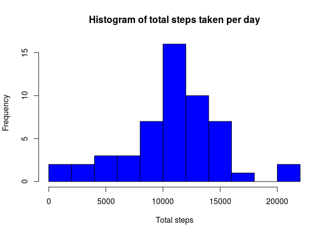
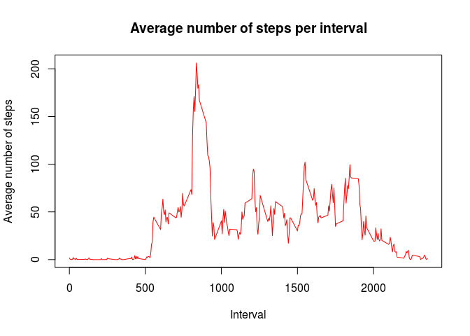
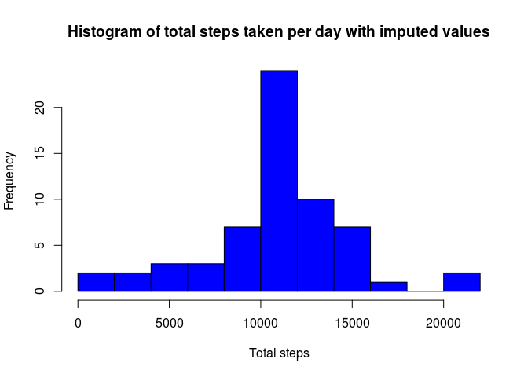
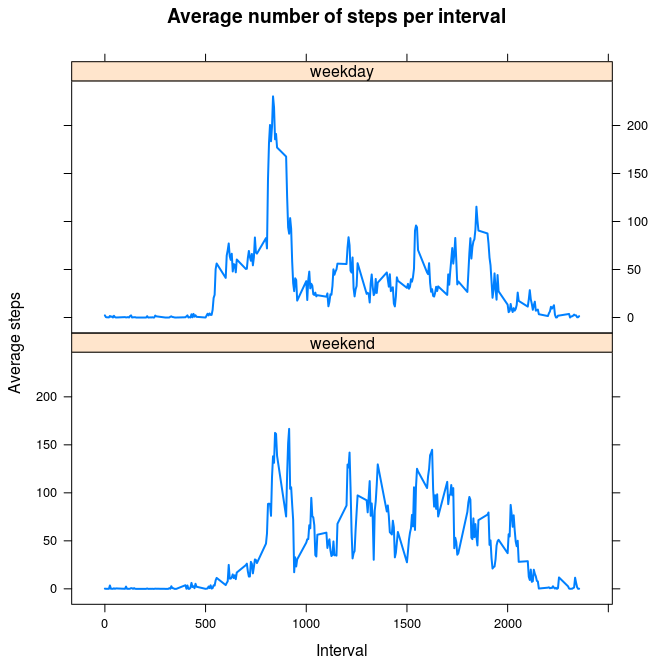

# Reproducible Research: Peer Assessment 1


## Loading and preprocessing the data

Read data from csv and convert the column *date* to Date class.


```r
activity <- read.csv("activity.csv", header = TRUE)
activity$date <- as.Date(activity$date)
str(activity)
```

```
## 'data.frame':	17568 obs. of  3 variables:
##  $ steps   : int  NA NA NA NA NA NA NA NA NA NA ...
##  $ date    : Date, format: "2012-10-01" "2012-10-01" ...
##  $ interval: int  0 5 10 15 20 25 30 35 40 45 ...
```

## What is mean total number of steps taken per day?

Total number of steps taken per day.


```
##          date total_steps
## 1  2012-10-01          NA
## 2  2012-10-02         126
## 3  2012-10-03       11352
## 4  2012-10-04       12116
## 5  2012-10-05       13294
## 6  2012-10-06       15420
## 7  2012-10-07       11015
## 8  2012-10-08          NA
## 9  2012-10-09       12811
## 10 2012-10-10        9900
## 11 2012-10-11       10304
## 12 2012-10-12       17382
## 13 2012-10-13       12426
## 14 2012-10-14       15098
## 15 2012-10-15       10139
## 16 2012-10-16       15084
## 17 2012-10-17       13452
## 18 2012-10-18       10056
## 19 2012-10-19       11829
## 20 2012-10-20       10395
## 21 2012-10-21        8821
## 22 2012-10-22       13460
## 23 2012-10-23        8918
## 24 2012-10-24        8355
## 25 2012-10-25        2492
## 26 2012-10-26        6778
## 27 2012-10-27       10119
## 28 2012-10-28       11458
## 29 2012-10-29        5018
## 30 2012-10-30        9819
## 31 2012-10-31       15414
## 32 2012-11-01          NA
## 33 2012-11-02       10600
## 34 2012-11-03       10571
## 35 2012-11-04          NA
## 36 2012-11-05       10439
## 37 2012-11-06        8334
## 38 2012-11-07       12883
## 39 2012-11-08        3219
## 40 2012-11-09          NA
## 41 2012-11-10          NA
## 42 2012-11-11       12608
## 43 2012-11-12       10765
## 44 2012-11-13        7336
## 45 2012-11-14          NA
## 46 2012-11-15          41
## 47 2012-11-16        5441
## 48 2012-11-17       14339
## 49 2012-11-18       15110
## 50 2012-11-19        8841
## 51 2012-11-20        4472
## 52 2012-11-21       12787
## 53 2012-11-22       20427
## 54 2012-11-23       21194
## 55 2012-11-24       14478
## 56 2012-11-25       11834
## 57 2012-11-26       11162
## 58 2012-11-27       13646
## 59 2012-11-28       10183
## 60 2012-11-29        7047
## 61 2012-11-30          NA
```

Extract only the number of steps removing NA.

```r
total_steps <- total_steps$total_steps[!is.na(total_steps$total_steps)]
```

Histogram of total steps per day.


```r
hist(total_steps, 
     breaks = 12,
     col = "blue",
     xlab = "Total steps",
     main = "Histogram of total steps taken per day")
```




```r
mean_steps <- mean(total_steps)
median_steps <- median(total_steps)
```

The mean number of steps taken per day is 10766 and the median is 10765.


## What is the average daily activity pattern?

Compute the aggregate results.


```r
average_steps_per_inteval <- setNames(aggregate(activity$steps,
                                                by = list(interval = activity$interval),
                                                FUN = mean, na.rm=TRUE),
                                      c("interval", "average_steps") )
```

Plot the average number of steps per interval.

```r
plot(average_steps_per_inteval$interval, average_steps_per_inteval$average_steps,
     type = "l",
     xlab = "Interval",
     ylab = "Average number of steps",
     main = "Average number of steps per interval",
     col="red")
```



Which 5-minute interval, on average across all the days in the dataset, contains the maximum number of steps?


```r
max_interval <- average_steps_per_inteval$interval[which.max(average_steps_per_inteval$average_steps)]
```

835


## Imputing missing values


```r
missing_mask <- is.na(activity$steps)
num_missing <- sum(missing_mask)
```

The total number of missing values is 2304.

Let us impute the missing values and substitute them with the average number of steps taken in the interval across all days. The dataframe with the imputed values is called *new_activity*.


```r
new_activity <- activity
new_activity$steps[missing_mask] <- sapply(activity$interval[missing_mask], 
                                           function(int) { 
                                               mask = average_steps_per_inteval$interval == int
                                               average_steps_per_inteval$average_steps[mask] 
                                               } 
                                           )
```

New histogram with the total steps taken per day with the imputed values.


```r
total_steps_imp <- setNames(aggregate(new_activity$steps, 
                                      by = list(date = new_activity$date),
                                      FUN = sum),
                            c("date","total_steps"))
total_steps_imp <- total_steps_imp$total_steps[!is.na(total_steps_imp$total_steps)]

hist(total_steps_imp, 
     breaks = 12, 
     col = "blue", 
     xlab = "Total steps",
     main = "Histogram of total steps taken per day with imputed values")
```




```r
mean_steps_imp <- mean(total_steps_imp)
median_steps_imp <- median(total_steps_imp)
```

The mean number of steps taken per day **with** the imputed values is 10766 and the median is 10766.
**Without** the imputed values, previously we obtained respectively 10766 and 10765. The mean is unchanged since we substitute each missing value with the mean and it is simple to prove that the mean remains unaltered if one adds it to the records and recompute the mean.


## Are there differences in activity patterns between weekdays and weekends?

First, we add a new column *day* containing a factor variable with two levels "weekend" and "weekday".


```r
weekdays_1 <- c('Monday', 'Tuesday', 'Wednesday', 'Thursday', 'Friday')
new_activity$day <- factor((weekdays(new_activity$date) %in% weekdays_1),
                           levels=c(FALSE, TRUE), labels=c('weekend', 'weekday')
                            )
```

Then, we compute the average number of steps per interval per type of day ("weekend" or "weekday"). Finally, we simply make a panel plot to show the different pattern for weekdays and weekends.


```r
average_steps_per_inteval <- setNames(aggregate(new_activity$steps,
                                            by = list(interval = new_activity$interval,
                                                      day = new_activity$day),
                                            FUN = mean, na.rm=TRUE),
                                      c("interval", "day", "average_steps") )


library(lattice)
xyplot( average_steps ~ interval | day,
        data = average_steps_per_inteval,
        lty=1,
        lwd=2,
        type="l",
        xlab="Interval",
        ylab="Average steps",
        main="Average number of steps per interval",
        layout=c(1,2))
```

<!-- -->


